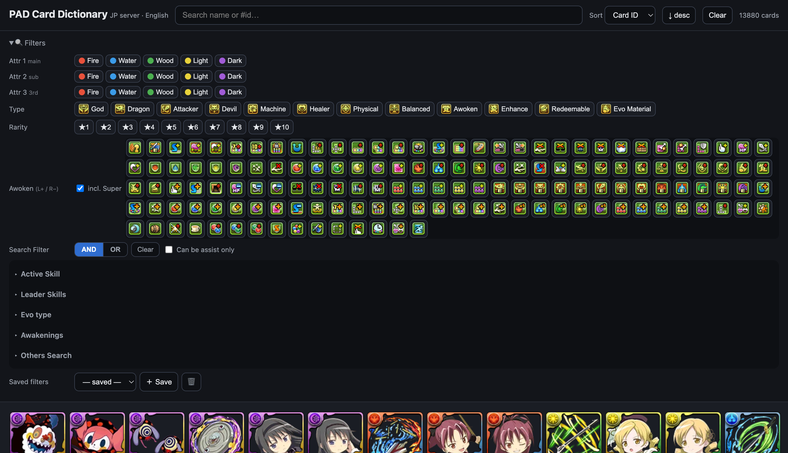
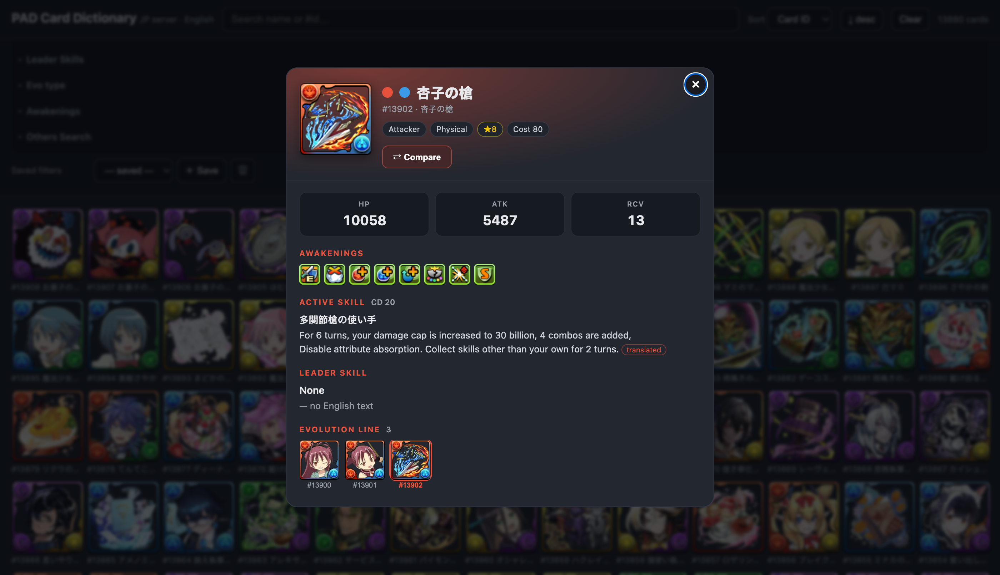
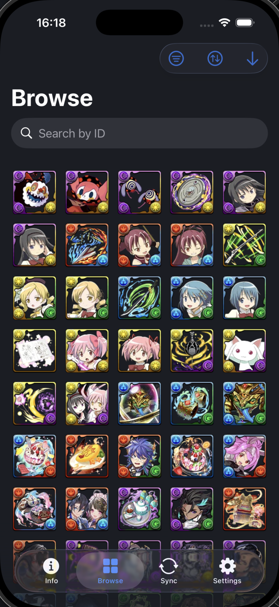
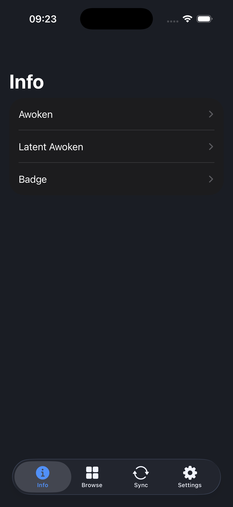

# PAD Card Dictionary (JP data · English)

A static, single-page **Puzzle & Dragons** card dictionary. It shows the
**Japanese-server** card list with **English** names and skill text, plus the
full search/filter toolkit from the original PADDashFormation tool. No build
step, no backend — it deploys straight to GitHub Pages.

🔗 **Live:** https://gcat332.github.io/pad-dictionary/ *(enable in repo Settings → Pages → `main` / root)*

## Screenshots

**Web**

<p>
  
  
</p>

**iOS**

<p>
  
  
</p>

## Features

- **13,878** JP-server cards — English names (`otLangName.en`), JP name kept as fallback for brand-new cards
- **Filters**
  - Attribute by position — Attr 1 (main) / Attr 2 (sub) / Attr 3 (3rd, latent-unlocked) —
    all three render their own frame corner on the card art (main/sub/third)
  - Type, Rarity, **Awoken** with counts (left-click +1, right-click −1, `incl. Super`), Can-be-assist
  - **Special Search** — the full hierarchical skill taxonomy ported from PADDashFormation
    (Active-skill & Leader-skill trees: Voids Absorption, Recovers Bind, Gravity, Reduce Shield, …),
    multi-select with **AND / OR**, ANDed with the other filters
- **Sort** — id, rarity, cost, attribute, HP/ATK/RCV, skill CD (+ direction)
- Saved filter presets (localStorage), attribute frames, infinite scroll
- **Skill text in English** — official EN where available; JP-only skills are machine-translated
  (marked `(translated)`); skill *names* are never translated
- **Search** matches card id, name, and skill text (including translated skills)

## How it works

| Layer | Source |
|-------|--------|
| Card data | `monsters-info/mon_ja.json` (JP cards, incl. EN names) |
| Skill effect engine | `monsters-info/skill_ja.json` — authoritative `type`/`params` (language-independent) drives the special-search classifier |
| English skill text | `monsters-info/skill_en.json` where the EN server has it |
| Translated skill text | `monsters-info/skill_tr.json` — 247 JP-only skill descriptions pre-translated offline |
| Skill parser + taxonomy | `engine.js` — the PADDashFormation skill parser & `specialSearchFunctions` tree, run on our data |
| Sprites / icons | `images/cards_ja/` (WebP sprite sheets), attribute frames, awoken/type icons |

`engine.js` is a single UMD closure authored as ordered partials in `engine/src/`
and concatenated by `./build-engine.sh` — edit the partials, not `engine.js`.
See `engine/README.md` for the file map.

## iOS app

`ios/PADDictionary/` is a native SwiftUI companion app ("PADD") with the same
JP-server card data, for offline/on-device browsing:

- **Info** — reference lists for Awoken, Latent Awoken, and Badge, each with name,
  effect text, and icon, sourced from GameWith/AppMedia guides
- **Browse** — the same card grid/search/filter set as the web version (Attr 1–3,
  Type, Rarity, Awoken with counts, Special Search), tap a card for full detail
  (stats, skill text, evolution/skill-evolution chain)
- **Sync** — pulls `mon_ja.json`/`skill_*.json` and sprites from this repo's GitHub
  Pages build into the app's local storage
- **Settings** — app info

No backend of its own; it just reads the same data this repo publishes.

## Scripts

```bash
# run locally
python3 -m http.server            # → http://localhost:8000

# rebuild engine.js after editing any partial in engine/src/
./build-engine.sh

# refresh data + sprites from upstream (blobless sparse clone; only the paths we use)
./update-data.sh                  # JSON + sprites (needs `brew install webp` to re-encode sprites to WebP)
./update-data.sh --data-only      # JSON only (fast)

# re-generate translations for any new JP-only skills (idempotent; needs network)
node build-translations.mjs
```

## Credits

This is a derivative viewer built on the work of others — full credit to them:

- **[Mapaler/PADDashFormation](https://github.com/Mapaler/PADDashFormation)** — all card/skill
  data, card sprites and icons, and the skill parser + special-search engine reused in `engine.js`
  (see `LICENSE`). PADDashFormation in turn credits:
  - **[kiootic/pad-rikuu](https://github.com/kiootic/pad-rikuu)** — card/skill binary parsing logic
  - **skyozora (战友网)** / [Mapaler/Download-pad.skyozora.com](https://github.com/Mapaler/Download-pad.skyozora.com) — Chinese card names/tags
- **Puzzle & Dragons** and all game data/artwork © **GungHo Online Entertainment, Inc.**
- JP→EN skill translation via the **Google Translate** `gtx` endpoint.

For personal, non-commercial use. Not affiliated with GungHo.
